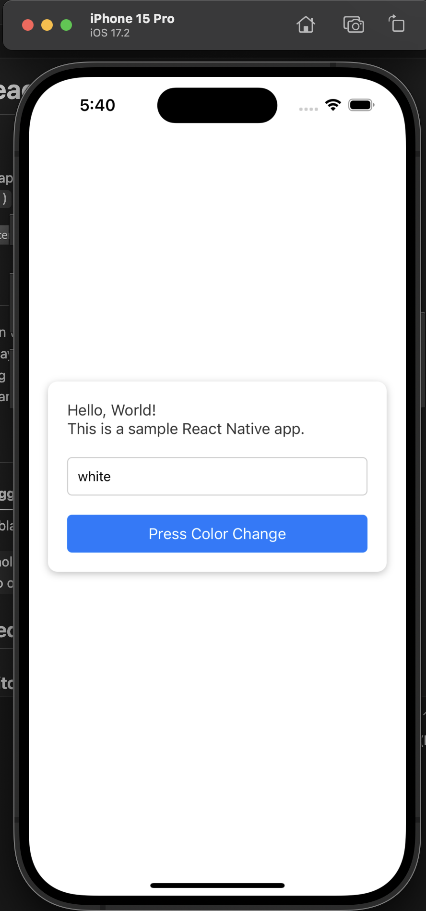
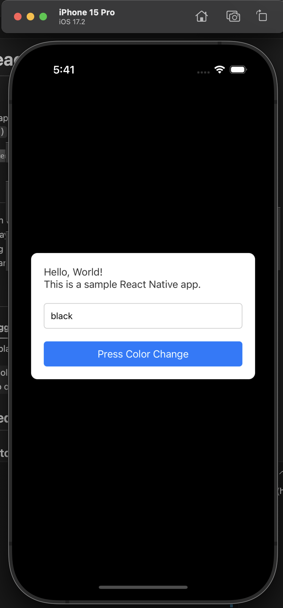

# 🖼️ 심플한 React Native 색상 토글 앱


`useState`와 동적 `StyleSheet`을 활용해 배경색을 토글하는 간단한 React Native 예제 앱입니다.


## ✨ 주요 기능

- 🎨 흰색과 검정색 배경 전환
- 📝 현재 색상 상태 실시간 표시
- ⚙️ `props` 기반 동적 스타일 적용
- 💡 외부 라이브러리 없이 간단한 UI

## 📱 미리보기

| 기본 (흰색)                         | 전환됨 (검정색)                     |
| ----------------------------------- | ----------------------------------- |
|  |  |

## 🚀 시작하기

### 1. 저장소 클론

```bash
git clone https://github.com/kasumil/RN_HelloWorld.git
cd react-native-color-toggle-app
```

### 2. 의존성 클론

yarn install

# 또는

npm install

### 3. 앱 실행

# iOS

npx react-native run-ios

# Android

npx react-native run-android

## 프로젝트 구조

<pre>
HelloWorld/
├── App.tsx
├── README.md
├── README.KR.md
├── LICENSE
├── .gitignore
├── node_modules/
└── package.json
</pre>
