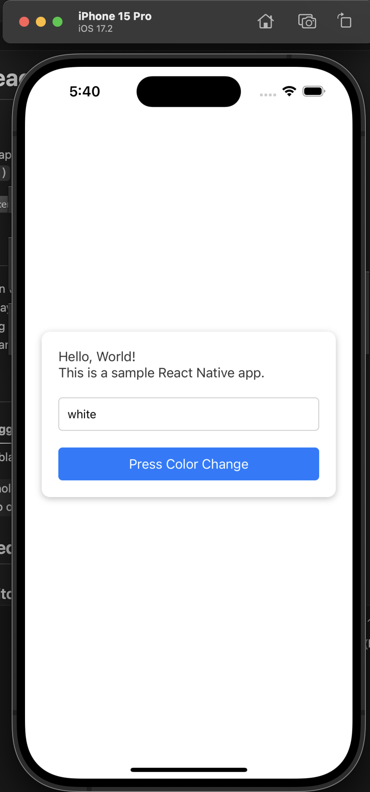
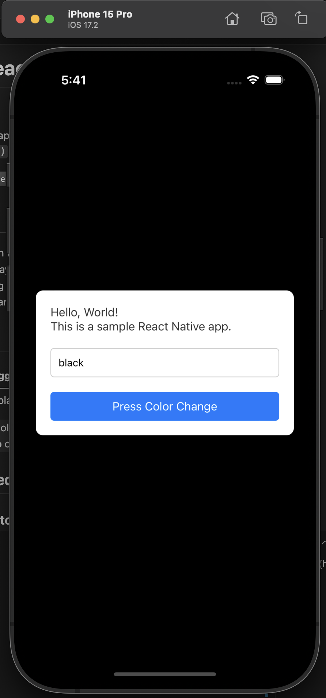

# 🖼️ Simple React Native Color Toggle App

🇰🇷 [한국어 README 보기](./README.KR.md)


A minimal React Native application that demonstrates dynamic styling using props and `StyleSheet.create()` based on the app’s internal state.


## ✨ Features

- 🎨 Toggle between white and black background
- 📝 Real-time display of current color state
- ⚙️ Dynamic styling with functional `StyleSheet`
- 💡 Simple and clean UI with no external dependencies

## 📱 Preview

| Default (White)                     | Toggled (Black)                     |
| ----------------------------------- | ----------------------------------- |
|  |  |

## 🚀 Getting Started

### 1. Clone the Repository

```bash
git clone https://github.com/kasumil/RN_HelloWorld.git
cd react-native-color-toggle-app
```

### 2. Install Dependencies

    yarn install

    # or

    npm install

### 3. Run the App

    # For iOS

    npx react-native run-ios

    # For Android

    npx react-native run-android

📂 File Structure

<pre>
HelloWorld/
├── App.tsx
├── README.md
├── README.KR.md
├── LICENSE
├── .gitignore
├── node_modules/
└── package.json
</pre>
